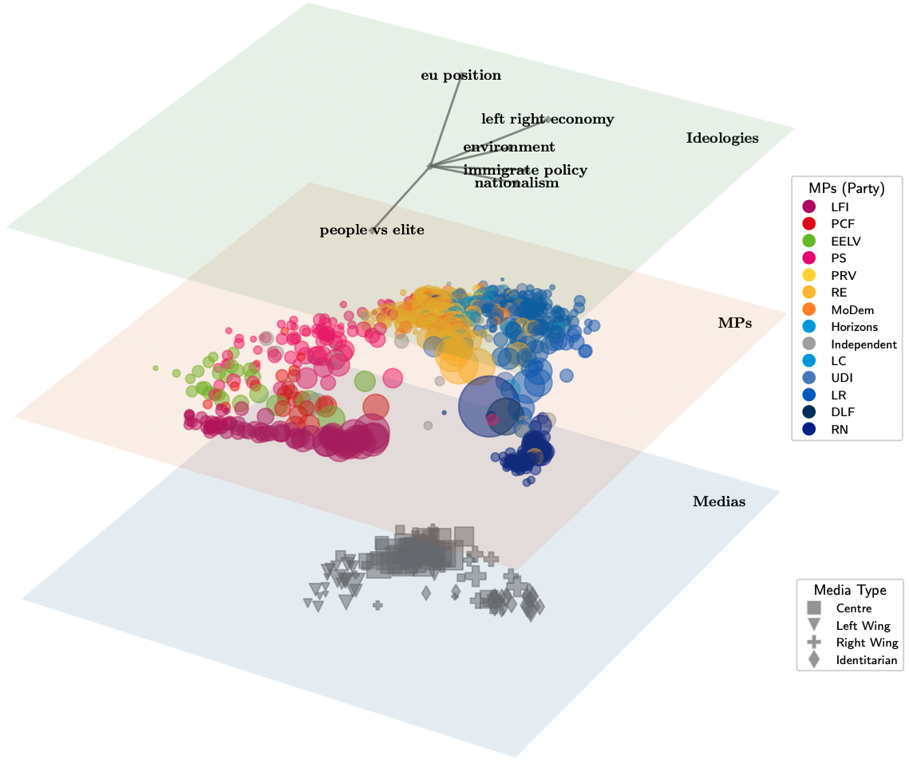

# MultiLayerNetViz

MultiLayerNetViz is a lightweight Python toolkit for visualizing and analyzing multi-layer networks, with a focus on the study of interacting social and semantic networks. This repository provides a Jupyter notebook and a Python function file to visualize multi-layer networks, particularly useful for understanding complex relationships in social media data. It was initially built to qualitatively analyze the results in [1].


Social network visualization of tweets of Members of the French Parliament (MPS) and media domains, projected onto an opinion space, data from [3].

## Features

- **Multi-layer network visualization**: Display multiple interconnected graphs (e.g., users and topics) in a single 3D plot.
- **Customizable layouts**: Node positions are computed using a combination of spring layouts and alignment matrices.
- **Node and edge annotations**: Nodes and edges can be labeled and colored based on network properties.
- **Interactive plotting**: Uses `matplotlib` with widget support for interactive exploration.
## Main Components

### Notebook: `example.ipynb`

This Jupyter notebook demonstrates the visualization workflow:

1.  **Data Loading**: Loads network parameters and adjacency matrices from a pickle file.
2.  **Layer Definition**: Defines the layers of the network using the `Layer` class from `multi_layer_NetViz_fcts.py`.
3.  **Layout and Styling**: Customizes the layout, colors, and markers for each layer.
4.  **Visualization**: Creates a `LayeredNetworkGraph` object and renders the 3D visualization.

### Module: `multi_layer_NetViz_fcts.py`

This Python module contains the core classes and functions for creating the multi-layer network visualization:

-   `Layer`: A class to represent a single layer in the network, including its graph, layout, and visual properties.
-   `LayeredNetworkGraph`: A class that takes a list of `Layer` objects and plots the 3D multi-layer network.
-   Helper functions for color calculation and marker creation.

## Getting Started

### Prerequisites

-   Python 3.13
-   [uv](https://docs.astral.sh/uv/) for environment and package management
-   Jupyter Notebook or JupyterLab (installed by `uv sync`)

Tabular data uses [Polars](https://pola.rs/), not pandas. Dense layouts and plotting still use NumPy.

```bash
uv sync
```

### Usage

1.  Clone the repository:
    ```bash
    git clone https://github.com/gas-abel/MultiLayerNetViz.git
    cd MultiLayerNetViz
    ```
2.  Install dependencies and run the example notebook:
    ```bash
    uv sync
    uv run jupyter notebook example.ipynb
    ```
This will open the notebook in your browser, and you can run the cells to see the visualization.

2. **Graph Construction**: Builds multiple graphs (`g1,g2,...`) representing different layers (e.g., users and topics).
3. **Node Alignment & Coloring**: Computes node alignments and colors based on network statistics.
4. **Layout Calculation**: Generates node positions using a convex combination of spring layouts and alignment matrices.
5. **Visualization**: Plots the multi-layer network in 3D using the `LayeredNetworkGraph` function from `multi_layer_NetViz_fcts.py`.

### Module: `multi_layer_NetViz_fcts.py`

This Python module contains core functions for:

- Computing node colors and alignments.
- Defining custom node markers.
- Rendering layered network graphs with advanced visualization options.

## Getting Started

**Just run the notebook!**
  - This visualization tool is used via a notebook for a more didactical approach of the components, making it easier to understand the workflow.
  - After `uv sync`, open `example.ipynb` with `uv run jupyter notebook example.ipynb` and execute the cells to visualize your bi-layer network.

## Example
The data included in this repository consists of social network users sharing tweets that contain url shortening services [2].
The notebook visualizes two layers:
- **Users (`W`)**: Social network users with their friendship networks and connections to url shortening services.
- **Topics (`T`)**: Topics represented by url shortening services, showing how users interact with them, as well as the interactions between these labeled types of content.
Edges and node sizes/colors reflect relationships and activity between layers.


## References
- [1] G. Abel, A. Kalogeratos, J. Randon-Furling, and J.-P. Nadal, *Uncovering Social Network Activity Using Joint User and Topic Interaction,* arXiv:2506.12842.
- [2] N. O. Hodas and K. Lerman, *The Simple Rules of Social Contagion,* Scientific Reports, vol. 4, no. 1, p. 4343, 2014.
- [3] Antoine Vendeville, Jimena Royo-Letelier, Duncan
Cassells, Jean-Philippe Cointet, Maxime Crépel, Tim
Faverjon, Théophile Lenoir, Béatrice Mazoyer, Benjamin Ooghe-Tabanou, Armin Pournaki, Hiroki Yamashita, and Pedro Ramaciotti. *Mapping the political landscape from data traces: multidimensional opinions of users, politicians and media outlets on X,* working paper, 2025.

## Acknowledgements
MultiLayerNetViz was presented during the 2025 ARCOM (French authority for media regulation) congress in Paris [see here](https://www.arcom.fr/actualites/quatrieme-journee-detudes-de-larcom-presentation-des-travaux-des-chercheurs-sur-les-medias-audiovisuels-et-numeriques).

To use this code, please cite [1] and acknowledge the use of this visualization tool in your work.

Developed using [NetworkX](https://networkx.org/), [Matplotlib](https://matplotlib.org/), [Polars](https://pola.rs/), and related scientific Python libraries.
The original code was created by Paul J. N. Brodersen in https://stackoverflow.com/a/60416989 and adapted here to include further customization and visualization features.
